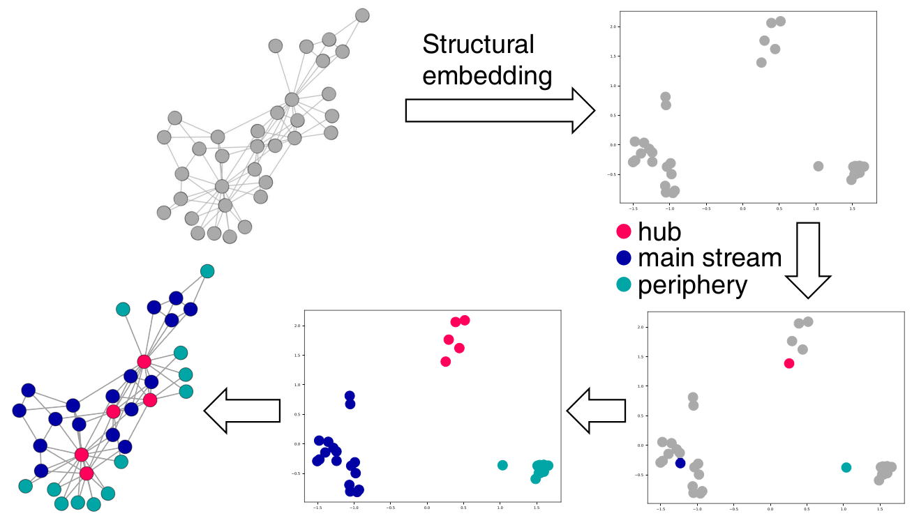
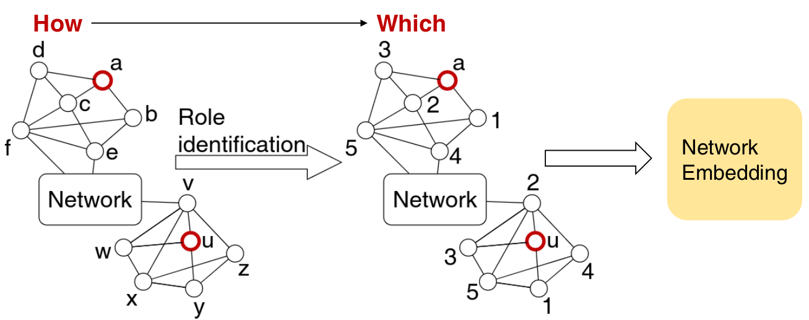

# RiWalk


This repository provides reference implementations of **RiWalk** as described in the paper:<br>
> RiWalk: Fast Structural Node Embedding via Role Identification.<br>
> Xuewei Ma, Geng Qin, Zhiyang Qiu, Mingxin Zheng, Zhe Wang.<br>
> IEEE International Conference on Data Mining, ICDM, 2019.<br>

The RiWalk algorithm learns continuous representations for nodes in graphs. The leaned representations capture structural similarities between nodes.  

<p align="center">

</p>

<br/>
<br/>

---

RiWalk decouples the structural embedding problem into a role identification procedure and a network embedding procedure. <br/>
The key idea of RiWalk can be illustrated as in the following picture. 
<p align="center">

</p>

Two nodes a and u residing far apart in a network have similar local topologies but totally different context nodes. However, after the role identification procedure, they have similar context and are indirectly densely connected, thus typical network embedding methods can be directly applied to learn structural embeddings.

### Usage
This repository provides several different implementations of RiWalk:
- src/RiWalk: a python implementation of RiWalk-SP and RiWalk-WL as described in the paper.
- src/RiWalkRW: a python implementation of RiWalk-RWSP and RiWalk-RWWL, two variations of RiWalk-SP and RiWalk-WL.<br/> RiWalkRW traverses a subgraph induced by random walk sequences instead of breadth-first searching the local subgraph.
- src/RiWalk-C: a C implementation of RiWalk-SP and RiWalk-RWSP. 

#### Full Command List
The full list of command line options is available with 
```	bash
# RiWalk
python3 src/RiWalk/RiWalk.py --help  
# RiWalkRW
python3 src/RiWalkRW/RiWalkRW.py --help  
# RiWalk-C
gcc -lm -pthread -Ofast -march=native -Wall -ffast-math -Wno-unused-result src/RiWalk-C/RiWalk.c -o src/RiWalk-C/RiWalk
src/RiWalk-C/RiWalk  
```

#### Example
We provide an example running script for the actor data set in [train_actor.sh](train_actor.sh).

#### Input
The supported input format is an edgelist:
```text
node1_id_int node2_id_int
```

#### Output
The output file has *n+1* lines for a graph with *n* vertices. 
The first line has the following format:
```text
num_of_nodes dim_of_representation
```
The next *n* lines are as follows:
```text	
node_id dim1 dim2 ... dimd
```
where dim1, ... , dimd is the *d*-dimensional representation learned by RiWalk.

### Acknowledgements
We would like to thank the authors of [node2vec](https://github.com/aditya-grover/node2vec), [struc2vec](https://github.com/leoribeiro/struc2vec), [GraphWave](https://github.com/snap-stanford/graphwave) and [LINE](https://github.com/tangjianpku/LINE) for the open access of the implementations of their methods.

### Miscellaneous
- Please send any questions you might have about the code and/or the algorithm to <xuew.ma@gmail.com>.

###  Citation
[https://dblp.org/rec/bibtex/conf/icdm/MaQQZW19](https://dblp.org/rec/bibtex/conf/icdm/MaQQZW19)
